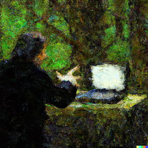
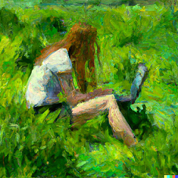

# Welcome to the NorESM Land Sites Platform

- [User guide](https://noresmhub.github.io/noresm-land-sites-platform/user_guide)
- [Technical documentation](https://noresmhub.github.io/noresm-land-sites-platform/documentation)
- [Sites](https://noresmhub.github.io/noresm-land-sites-platform/land-sites)
- [About us](https://noresmhub.github.io/noresm-land-sites-platform/about)
- [Contributing and Code of Conduct](https://noresmhub.github.io/noresm-land-sites-platform/contributing)

The NorESM-LSP simplifies the modelling process and model setup. The software might be used ...

1. In education, such as interdisciplinary workshops or data labs in Ecological Climatology-related university courses, where model experiments will typically be simple and designed to increase understanding of the model framework and Earth System Science. The output of models will typically not be published.
2. By beginner modelers, e.g. post-graduate students or scientists who are new to CLM-FATES modelling, to set up scientific model experiments under the supervision of or in collaboration with more experienced modelers. 
3. By experienced modelers outside the core model development group at [NCAR](https://ncar.ucar.edu/), who benefit from the containerisation of the model.

*Model experiments with CLM-FATES simulate potential vegetation. Images by DALL-E x Eva Lieungh*
